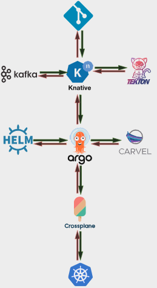

# BlanketOps Environments

* BlanketOps aims to revolutionarize the rise of DevOps through extensive customization of cloud native resources tailored for your organization's needs.

## Overview

* Blanket Ops Environments is Internal developer platform for organizations and startups to quickly setup resources in the cloud following a DevOps Model by leveraging our kubernetes custom api.

* A platform agnostic system that communicates with cloud providers you register for(support only for AWS in this release), to create,update,view and delete resources, as compositions or exacts of cloud services. 

* Container Registries, Releases,Pipelines,Processes and Deployments from years of research following industry best practices.

## Prerequisites

* `Make`    : Makefile execution.
* `Kubectl` : Interact with cluster of choice.
* `Kind`    : Install for a faster demonstration and trying out .on the fly.
* `BlanketOps` : BlanketOps offerings.

## Resources

* `Make`    : [Make](https://gnu.org/software/make/).
* `Kubectl` : [Kubectl](https://kubernetes.io/docs/reference/.kubectl/)
* `Kind`    : [Kind](https://kind.sigs.k8s.io/).
* `BlanketOps` : [BlanketOps](https://blanketops/co.za/).

## Commands

* `make cluster`  : Create a Kind cluster locally .
* `make install`  : Install BlanketOps manifests.
* `make services` : Interact with BlanketOps Enviroments.
* `make setup`    : Setup and execute HealthChecks on the BlanketOps installed manifests.
* `make teardown` : Delete Kind cluster and docker prune. resources.
* `make --h`       : Learn more about Make Commands, Subcommands and Flags.

## CLI Commands

* `blanketops environments` :  Interact with environments.
* `blanketops --h  ` :  View more information about commands, subcommands and flags.

## CLI SubCommands
